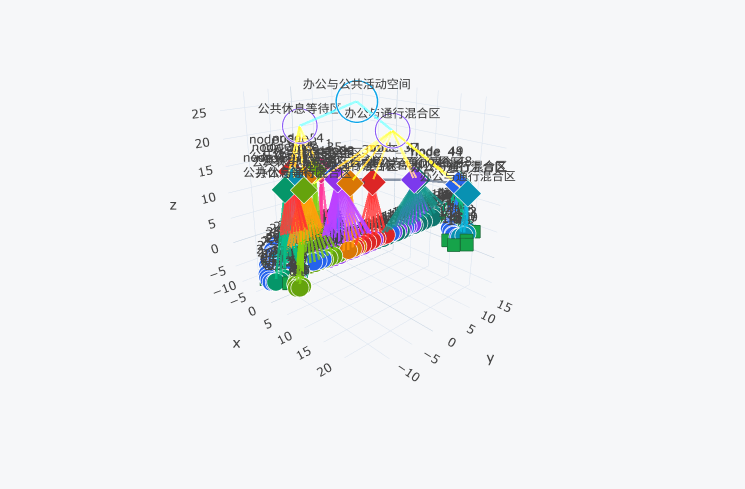
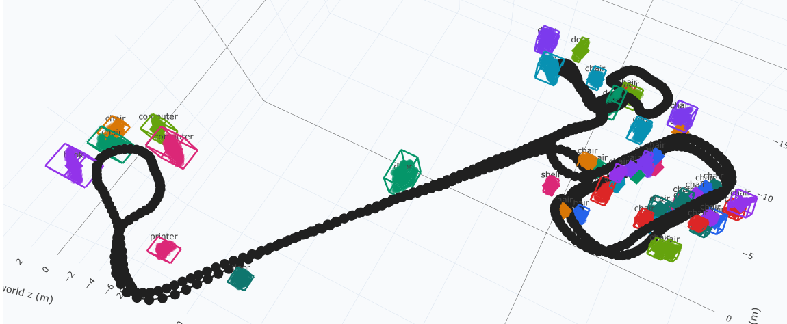

# 项目展示

本仓库用于展示语义拓扑地图与 3D 物体全局地图结果。

## 在线文件

- `nav_graph_visualization_3d.html`：3D 语义拓扑导航图，可交互查看路径点、拓扑节点、语义区域和导航对象。
- `object3d_global_map.html`：3D 物体全局地图，可交互查看相机轨迹、物体位置和 3D bbox。

## 动态预览

该 GIF 展示了语义拓扑地图与 3D 物体地图的动态浏览效果，适合在 README 中快速预览项目展示结果。

## Rerun 回放文件

完整回放文件 `semantic_topomap_replay.rrd` 体积较大，已通过网盘分享：

- 链接：https://pan.baidu.com/s/1eKSADFu09DW_dsBhmsyWmw
- 提取码：`0825`

## 预览图

### 3D 语义拓扑导航图

该图展示了机器人运行轨迹、路径点、拓扑节点、语义区域层级以及导航对象之间的空间关系，适合快速查看整体语义拓扑结构。

### 3D 物体全局地图

该图展示了全局坐标系下的相机轨迹和稳定物体分布，包括 chair、door、computer、printer 等对象及其 3D 空间位置。
